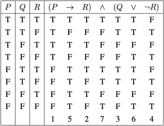

# logic

## logical statement (proposition)

### law of excluded middle

statement is either true or false

### statement combination

#### conjunction $P\wedge Q$

$P$ and $Q$

#### disjunction $P\vee Q$

$P$ or $Q$

#### negation $¬P$

not $P$

#### conditional connective $P→Q$

if $P$ then $Q$    *antecedent $P$, consequent $Q$*\
or: $Q$ only if $P$\
or: $Q$ if $P$

- converse $Q→P$
- inverse $¬P→¬Q$
- contrapositive $¬Q→¬P$

#### biconditional $P\leftrightarrow Q$

$P$ iff $Q$\
or: $Q$ iff $P$

#### compound statement

- $¬$ has higher precedence
- $¬(P→Q)\equiv P\wedge¬Q$

##### truth table

column 1~3: iter T and F every 1, 2, 4, … row

calculate column of individual statement and calculate column under operator

##### tautology

statement, always true

e.g. $P\vee¬P$

##### contradiction

statement, always false

e.g. $P\wedge ¬P$

### relation between statement (meta statement)

logical statement about logical statement

#### logical implication $P⇒Q$

$Q$ is true whenever $P$ is true\
or: $P→Q$ is tautology

- everything can be "proven" using contradiction
$$
Contradiction⇒Anything
$$
- in truth table, use $→$ in replace of $⇒$

1. $(P → Q)\wedge P ⇒ Q$ (Modus Ponens)
1. $P\wedge Q ⇒ P$ (Simplification)
1. $P ⇒ P\vee Q$ (Addition)
1. $(P\wedge Q)\wedge¬Q ⇒ P$ (Modus Tollendo Ponens)
1. $P ↔ Q ⇒ P → Q$ (Biconditional-Conditional)
1. $(P → Q)\wedge(Q → P) ⇒ P ↔ Q$ (Conditional-Biconditional)
1. $(P → Q)\wedge(Q → R) ⇒ P → R$ (Hypothetical Syllogism)
1. $(P → Q)\wedge(R → S)\wedge(P\vee R) ⇒ Q\wedge S$ (Constructive Dilemma)

#### logical equivalence $P⇔ Q$

$Q$ is true iff $P$ is true
and $P$ is true whenever $Q$ is true\
or: $P⇔ Q$ is tautology

1. $¬(¬P) ⇔ P$ (Double Negation)
1. $P\wedge Q ⇔ Q\wedge P$ (Communitative Law)
1. $(P\vee Q)\vee R ⇔ P\vee(Q\vee P)$ (Associative Law)
1. $P\wedge(Q\vee R) ⇔ (P\wedge Q)\vee(P\wedge R)$ (Distributive Law)
1. $P → Q ⇔ ¬P\vee Q$
1. $P → Q ⇔ ¬Q → ¬P$ (Contrapositive)
1. $¬(P\wedge Q) ⇔ ¬P\vee ¬Q$ (De Morgan's Law)
1. $¬(P\vee Q) ⇔ ¬P\wedge ¬Q$ (De Morgan's Law)
1. $¬(P → Q) ⇔ P\wedge¬Q$
1. $¬(P ↔ Q) ⇔ (P\wedge¬Q)\vee(¬P\wedge Q)$

## quantifier

- universal quantifier $∀$
    - if all predicate value satisfy
    - $∀\ x\in U,P(x)⇔\displaystyle\bigwedge_{x\in U}P(x)\quad(U≠∅)$
    - if $U=∅$, $∀\ x\in U,P(x)$ is true
- existential quantifier $∃$
    - if at least one predicate value satisfy
    - "some" predicate value satisfy
    - $∃\ x\in U,P(x)⇔\displaystyle\bigvee_{x\in U}P(x)\quad(U≠∅)$
    - if $U=∅$, $\ x\in U,P(x)$ is false
- relationship
    - natural implication\
        $∀\ x\in U,P(x)→∃\ x\in U,P(x)\quad(U≠∅)$
    - $¬∀\ x\in U,P(x)⇔∃\ x\in U,¬P(x)$
        - reason\
            $$
            ¬∀\ x\in U,P(x)
            ⇔¬\bigwedge_{x\in U}P(x)\\
            ⇔\bigvee_{x\in U}¬P(x)
            ⇔∃\ x\in U,¬P(x)
            $$

### predicate

- expression
- contain predicate variable
- either true of false depending on value of predicate variable

#### predicate variable

free variable in predicate

- domain\
    all possible values of predicate variable

### multiple quantifier (nested quantifier)

quantifier that occur within scope of other quantifier

- free variable\
    not in quantifier
- bound variables\
    in quantifier
- negation\
    negate each one

#### order of quantifier

$P(x,y):=y\in x$
$$
∀\ x,∀\ y,P(x,y) ⇔ ∀\ y,∀\ x,P(x,y)
\\
\Downarrow\qquad\qquad\qquad\qquad\Downarrow
\\
∃\ x,∀\ y,P(x,y) \qquad ∃\ y,∀\ x,P(x,y)
\\
\Downarrow\qquad\qquad\qquad\qquad\Downarrow
\\
∀\ y,∃\ x,P(x,y) \qquad ∀\ x,∃\ y,P(x,y)
\\
\Downarrow\qquad\qquad\qquad\qquad\Downarrow
\\
∃\ x,∃\ y,P(x,y) ⇔ ∃\ y,∃\ x,P(x,y)
$$

## strategy for proof

- theorem
- proposition
- lemma
- corollary

### direct proof

### contrapositive

$$
¬Q→¬P⇔P→Q
$$

### proof by contradiction

$$
¬(P→Q)
⇔¬(P\wedge¬Q)
⇔¬P\vee Q
$$

### mathematical induction

- $P(1)$
- $∀\ n\in \N,P(n)→P(n+1)$
- $⇒∀\ n\in \N,P(n)$

## set theory

### set

- order is irrelevant
- repetition have no effect
- singleton—set with one element $\{a\}$
- empty set (null set) $∅$

#### element (member) $a$

object in set $a\in A$

#### represent set

- listing element
- specify element satisfy criterion
    - open bounded interval $(a,b)$
    - close bounded interval $[a,b]$
    - half-open interval
    - open unbounded interval $(a,∞)$ or $(-∞,b)$
    - close unbounded interval $[a,∞)$ or $(-∞,b]$

### cardinality

size of the set $|A|$

#### countably infinite set $A$

- $∃$ one-to-one correspondence between element in $A$ and $\N$
- $|A|=∞$

#### uncountably infinite set $A$

- $|A|=∞$
- not countably infinite

### subset

$A$ is a subset of $B$
$$
A⊆ B⇔∀\ x,(x\in A)→(x\in B)
$$

- $A⊆ A$
- $∅⊆ A$
- $((A⊆ B)\wedge(B⊆ C))→(A⊆ C)$
- $(A⊆ B)\wedge(B⊆ A)⇔(A=B)$
- $A$ has $2^{|A|}$ subset

#### equivalent set

$$
A=B ⇔ (A\subseteq B)\wedge(B\subseteq A)
$$

#### proper subset

$$
A\subset B⇔(A⊆ B)\wedge(A≠B)
$$

#### power set $\mathcal P(A)$

$\mathcal P(A)=\{S|S⊆ A\}$

- cardinality $|\mathcal P(A)|=2^{|A|}$

### set operation

#### union $A\cup B$

$$
A\cup B=\{x|(x\in A)\vee(x\in B)\}
$$

- $\mathcal P(A\cup B)=\mathcal P(A)\cup \mathcal P(B)⇔A=B$
- $\displaystyle\bigcup_{\alpha\in I}S_\alpha=\{
    x|∃\ \alpha\in I,x\in S_\alpha
\}$

#### intersection $A\cap B$

$$
A\cap B=\{x|(x\in A)\wedge(x\in B)\}
$$

- $\mathcal P(A\cap B)=\mathcal P(A)\cap\mathcal P(B)$
- $\displaystyle\bigcap_{\alpha\in I}S_\alpha=\{
    x|∀\ \alpha\in I,x\in S_\alpha
\}$

##### disjoint set

$A\cap B=∅$

#### difference $A-B$

$$
A-B=\{x|(x\in A)\wedge(x\notin B)\}
$$

- $A-B\subseteq A$
- $(A-B)\cap B=∅$
- $A-B=∅ ⇔ A\subset B$
- $A\subseteq B ⇒ A-C=A\cap(B-C)$
- $A\subseteq B ⇒ C-B\subseteq C-A$
- $C-(A\cup B)=(C-A)\cap(C-B)$
- $C-(A\cap B)=(C-A)\cup(C-B)$

##### complement $A^c$

$$
A^c=\{
    x|(x\in U)\wedge(x\notin A)
\}
=U-A
$$

- De Morgan's logical identity
    $$
    (A\cup B)^c=A^c\cap B^c\\
    (A\cap B)^c=A^c\cup B^c
    $$

#### Cartesian product

$$
A×B=\{(x,y)|(x\in A)\wedge(y\in B)\}
$$

- $|A×Y|=|A||B|$
- $A×∅=∅×A=∅$

## relation $R$ from $A$ to $B$

- subset $R ⊆ A×B$
- $aRb$, or $a$ has relation $R$ with $b⇔(a,b)\in R$

### relation class of $x$ with respect to $R$

$$
R[x]=\{y\in B|xRy\}
$$

- also: $[x]$
- reflexive relation\
    $∀\ x, \quad xRx$
- symmetric relation\
    $∀\ xRy,\quad yRx$
- transitive relation\
    $∀\ xRy,yRz,\quad xRz$

#### equivalence relation $∼$

reflexive, symmetric, transitive relation

##### equivalence class $[x]$

$$
[x]=\left\{
    y|x∼y
\right\}
$$

- $∀\ x,y\in A≠ ∅,x∼y,\quad [x]=[y]$
- $∀\ x,y\in A≠ ∅,x\nsim y,\quad [x]\cap[y]=∅$

##### quotient set $A/∼$

$$
A/∼=\left\{
    [x]|x\in A
\right\}
$$

### partition $\mathcal D$

set of exclusive non-empty subset of $A$

- $P,Q\in\mathcal D,P≠Q ⇒ P\cap Q= ∅$
- $\displaystyle\bigcup_{P\in\mathcal D}P=A$

#### corollary

$A≠ ∅$, $∼$ is an equivalence relation on $A \\⇒ A/∼$ is a partition of $A$

## function $f:X → Y$

- domain $X$
- codomain $Y$
- $F ⊆ X × Y$
- $ ∀\ x\in X,\quad ∃$ one and only one $(x,y)\in F$
- range $\{f(x)\in Y|x\in X\}$
- equal function
    - same domain
    - same range
    - same range
    - $∀\ x\in$ domain, same value

### function property

- injective (one-on-one)
    - $∀\ x_1,x_2,\quad x_1≠x_2 ⇔ f(x_1)≠f(x_2)$
    - $⇒f^{-1}(f(A))=A$
- surjective (onto)
    - $∀\ y\in B, ∃\ x\in A,\quad f(x)=y$
    - $⇒f(f^{-1}(B))=B$
- bijective (injective + surjective, or one-to-one correspondence)

### function composition $f\circ g$

composition of $g$ and $f$
$$
(f\circ g)(x)=f(g(x))
$$

- association law $(h\circ g)\circ f=h\circ g(\circ f)$
- identity law $f:A →B\quad ⇒ f\circ1_A=f,1_B\circ f=f$
    - $1_A:A → A,1_A(x)=x$
- $f,g$ injective $⇒ g\circ f$ injective
- $f,g$ surjective $⇒ g\circ f$ surjective
- $f,g$ bijective $⇒ g\circ f$ bijective

#### inverse function $f^{-1}$

bijective function has unique inverse function $f^{-1}:Y → X$
$$
∀\ x\in X,f^{-1}(f(x))=x\qquad ∀\ y\in Y,f(f^{-1}(y))=y
$$

- injective function $f:X → Y$ define bijection $g:X → R$
    - $R$ is range of $f$
    - $g(x)=f(x)$

### image $f(P)$

$P\subseteq A$
$$
f(P)=\left\{
    f(p)|p\in P
\right\}
$$

#### inverse image (preimage) $f^{-1}(Q)$

$$
f^{-1}(Q)=\left\{
    p\in A|f(p)\in Q
\right\}
$$

- $A_1 ⊆ A_2 ⊆ A ⇒ f(A_1) ⊆ f(A_2)$
- $f(f^{-1}(B)) ⊆ B$
- $f^{-1}(f(A))\supseteq A$

more theorem

- $A_1 ⊆ A_2 ⊆ A ⇒ f(A_1) ⊆ f(A_2)$
- $f$ injective $⇒ f^{-1}(\{f(x)\})=\{x\}$
- $C ⊆ A,S ⊆ B ⇒ (f(C) ⊆ S ⇔ C ⊆ f^{-1}(S))$
- $B_1 ⊆ B_2 ⊆ B ⇒ f^{-1}(B_1) ⊆ f^{-1}(B_2)$
- $f$ injective $⇔ ∀\ C\in A,C ⊆ f^{-1}(f(C))$
- $f$ surjective $⇔ ∀\ D\in B,f(f^{-1}(D)) ⊆ D$
- $f$ injective $⇔ ∀\ C_1,C_2 ⊆ A,f(C_1\cap C_2) ⊆ f(C_1)\cap f(C_2)$
- $∀\ C_1,C_2 ⊆ A,f(C_1\cup C_2) = f(C_1)\cup f(C_2)$
- $∀\ D_1,D_2 ⊆ B,f(D_1\cap D_2) = f(D_1)\cap f(D_2)$
- $∀\ D_1,D_2 ⊆ B,f(D_1\cup D_2) = f(D_1)\cup f(D_2)$

# metric space $(X,d)$

## metric $d$

a function
$$
d:X × X\rightarrow\R
$$

- $∀\ x≠y\in X,d(x,y)>0,\qquad ∀\ x=y\in X,d(x,y)=0$
- $∀\ x,y\in X,d(x,y)=d(y,x)$
- $∀\ x,y,z\in X,d(x,y)+d(y,z)≥d(x,z)$

### distance $d(x,y)$

example

- Cartesian distance
    $$
    d_2(x,y)=\sqrt{∑_{i=1}^n(x_i-y_i)^2}
    $$
    - Cauchy-Schwartz inequality
    $$
    \left|
        ∑_ix_iy_i
    \right|^2≤∑_ix_i^2y_i^2
    $$
- Manhattan distance
    $$
    d_1(x,y)=∑_{i=1}^n|x_i-y_i|
    $$
- Max
    $$
    d_∞(x,y)=\max_{i=1}^n\{|x_i-y_i|\}
    $$
- zero-one
    $$
    d(x,y)=\begin{cases}
        1&x≠y\\
        0&x=y
    \end{cases}
    $$
- Jaccard Distance
    $$
    d_j(A,B)=1-\frac{|A\cap B|}{|A\cup B|}\\[6pt]
    =\frac{|A\Delta B|}{|A\cup B|}\\[6pt]
    =\frac{|A\cup B|-|A\cap B|}{|A\cup B|}
    $$
- cosine distance (not metric)
    $$
    d_{cos}(x,y)=1-\frac{\vec x\cdot\vec y}{\lVert\vec x\rVert\lVert\vec y\rVert}
    $$

### $d$-open ball (open ball)

$d$-open ball of radius $\epsilon$ centered at $x$

$$
B_d(x,\epsilon)=\{
    y\in X|d(x,y)<\epsilon
\}
$$

### open set $W$

subset $W$ of metric space $(X,d)$

$$
∀\ w\in W,∃\ \epsilon>0,B_d(w,\epsilon) ⊆ W
$$

$∀$ metric space $(X,d)$

- each open ball if open set
- $∅$ and $X$ are open
- union of open set is open
- finite intersection of open set is open
- subset $G$ is open set $⇔ G$ is the union of all open ball in $G$

# linear algebra

## Abelian group (commutative group) $(G,\cdot)$

set $G$ of object and one operation $\cdot$

- closure $∀\ a,b\in G,a\cdot b\in G$
- associativity $∀\ a,b,c\in G,(a\cdot b)\cdot c=a\cdot(b\cdot c)$
- identity element $∃\ e\in G,∀\ a\in G,a\cdot e=a$
- inverse element $∀\ a\in G,∃\ b\in G,a\cdot b=e$
- commutativity $∀\ a,b\in G,a\cdot b=b\cdot a$

## field $(F,+,\cdot)$

set $F$ of object and two operation,
addition $+$,
multiplication $\cdot$

- closure $∀\ a,b\in F,(a+b\in F,a\cdot b\in F)$
- associativity $∀\ a,b,c\in F,((a+b)+c=a+(b+c),(a\cdot b)\cdot c=a\cdot(b\cdot c))$
- identity element $∃\ 0,1\in F,∀\ a\in G,(a+0=a,a\cdot 1=a)$
- additive inverse $∀\ a\in G,∃$ unique $-a\in F,a+(-a)=0$
- multiplicative inverse $∀\ a≠0\in F,∃$ unique $a^{-1}\in F,a\cdot a^{-1}=1$
- distribution of multiplication over addition
    $∀\ a,b,c\in F,a\cdot(b+c)=a\cdot b+a\cdot c$

### relationship with Abelian group

- $(F,+)$ is Abelian group
- $(F-\{0\},\cdot)$ is Abelian group

### commutative ring $(F,+,\cdot)$

no inverse element for multiplication

## vector space

vector space consist of

- field $F$ of scalar
- set $V$ of vector
- vector addition: $v,w\in V → v+w\in V$
    - commutative $\vec v+\vec w=\vec w+\vec v$
    - associative $(\vec u+\vec v)+\vec w=\vec u+(\vec v+\vec w)$
    - $∃$ unique $\vec0\in V,∀\ \vec v\in V,\vec v+\vec0=\vec v$
    - $∀\ v\in V,∃$ unique $-\vec v\in V,\vec v+(-\vec v)=\vec0$
- scalar multiplication: $s\in F,\vec v\in V → s\vec v\in V$
    - $∀\ \vec v\in V,1\vec v=\vec v$
    - $(ab)\vec v=a(b\vec v)$
    - $s(\vec v+\vec w)=s\vec v+s\vec w$
    - $(a+b)\vec v=a\vec v+b\vec v$

### subspace $W$ of vector space $V$

- $W ⊆ V$
- $W$ is vector space

$W ⊆ V$ is subspace of $V\Leftarrow$

- closed under addition $∀\ \vec u,\vec v\in W,\vec u+\vec v\in W$
- closed under scalar multiplication $∀\ s\in F,\vec u\in W,s\vec u\in W$

for subspace $U_1,U_2\in V$

- $U_1\cap U_2$ is subspace
- $(U_1 ⊆ U_2)\vee(U_2 ⊆ U_1) ⇔ U_1\cup U_2$ is subspace

#### sum of subspace $U_1+U_2$

$U_1,U_2$ are subspace of $V$
$$
U_1+U_2=\{
    u_1+u_2|u_1\in U_1,u_2\in U_2
\}
$$

- $U_1+\cdots+U_m$ is the smallest subspace of $V$ containing $U_1,\cdots,U_m$

##### direct sum $U_1\oplus U_2$

$$
U_1+U_2=U_1\oplus U_2
⇔ ∃\text{ unique }\vec u_1\in U_1,\vec u_2\in U_2,\vec u=\vec u_1+\vec u_2
\\[12pt]
⇔
∃\text{ unique }\vec u_1\in U_1,\vec u_2\in U_2,\vec0=\vec u_1+\vec u_2
\\[12pt]
⇔
U_1\cap U_2=\{0\}\qquad(\text{only work for two subspace})
$$

### span $span(U)$

set of all finite linear combination of vector in $U$
$$
span(U)=\{
    \lambda_1\vec u_1+\cdots+\lambda_n\vec u_n|\lambda_i\in F,\vec u_i\in U
\}
$$

- $U$ is subset of $V$
- span form a subspace
- $span(U)$ is smallest subspace in $V$ containing $U$
- $\vec v_1,\cdots,\vec v_n$ span $V ⇔ span(\vec v_1,\cdots,\vec v_n)=V$
- finite-dimensional $V ⇔$ finite number of vector span $V$
    - infinite-dimensional $V$ otherwise

#### linear combination

$\vec w\in V$ is linear combination of $\vec v_1,\cdots,\vec v_n\in V$
$$
⇔ ∃\ s_1,\cdots,s_n\in F,w=∑_{i=1}^ns_i\vec v_i
$$

#### equivalent subset $S,T$

any element in $S$ is linear combination of $T$, vice versa

#### polynomial $\mathscr P(F)$

polynomial function $p:F → F$

$$
∀\ z\in F,∃\ a_0,\cdots,a_m\in F,p(z)=a_0+a_1z+\cdots+a_mz^m
$$

- $\mathscr P(F)$ is set of all polynomial with coefficient in $F$
    - infinite-dimensional
- $\mathscr P_m(F)$ is set of all polynomial with coefficient in $F$
    and degree at most $m$

### linear dependence/ linear independence

$\vec u_1,\cdots,\vec u_n\in V$ are linearly dependent\
$⇔ ∃\ s_1,\cdots,s_n\in F$ not all $0,\displaystyle∑_{i=1}^ns_i\vec u_i=0$

subset $U ⊆ V$ is linearly dependent\
$⇔ \vec u_1,\cdots,\vec u_n\in U$ are linearly dependent

- $∀$ finite $S\in U,S$, $S$ linearly independent $⇔ U$ linearly independent

#### Steinitz exchange lemma

$\vec\alpha_1,\cdots,\vec\alpha_n\in V$ linearly independent\
could be linear combination of $\vec\beta_1,\cdots,\vec\beta_n\in V$\
$⇒$

- $s≤t$
- $\vec\alpha_1,\cdots,\vec\alpha_n$ could exchange $s$ vector in $\vec\beta_1,\cdots,\vec\beta_n$,
    set $\vec\beta$s remain equivalent

### basis of $V$

list of vector $\vec u_1,\cdots,\vec u_n\in V$

- linearly independent
- span $V$

$⇔$
$$
∀\ \vec v\in V, ∃\ a_1,\cdots,a_n\in F,\vec v=a_1\vec u_1+\cdots+a_n\vec u_n
$$

- all spanning list in vector space can be reduced to basis
- all vector space have basis
- linearly independent finite set in finite-dimensional vector space can be extended
    to basis of the vector space
- $∀\ U$ subspace of finite-dimensional vector space $V,
    ∃\ W$ subspace of $V,V=U\oplus W$

#### finite-dimensional vector space

has finite basis

- infinite-dimensional vector space

#### dimension of finite-dimensional vector space $\dim V$

all basis of $V$ have same number of element $=\dim V$

- $\Leftarrow$ Steinitz exchange lemma
- $U$ is subspace of $V ⇔ \dim U≤\dim V$

##### dimension of a sum

$U_1,U_2$ are subspace of same finite-dimensional vector space
$$
\dim(U_1+U_2)=\dim U_1+\dim U_2-\dim(U_1\cap U_2)
$$

- $U_1+\cdots+U_m$ is a direct sum ($U_1\oplus\cdots\oplus U_m$)
    $$
    ⇔ \dim(U_1+\cdots+U_m)=\dim U_1+\cdots+\dim U_m
    $$

### invertible matrix

$A\in F^{n\times n}$ invertible

$⇔$ column (/row) of $A$ from basis for $F^n$

### matrix multiplication (matrix product)

$A\in F^{m\times n},B\in F^{n\times p},C=AB$

$$
c_{ij}=\vec a_k\vec b_k^*
=∑_{k=1}^na_{ik}b_{kj}
$$

- column of $C$ is linear combination of column of $A$
- row of $C$ is linear combination of row of $B$
- $⇒ Rank\ C≤\min\{Rank\ A,Rank\ B\}$

relevant property

- $Rank(A+B)≤Rank\ A+Rank\ B$
- $Rank\ A^TA=Rank\ AA^T=Rank\ A=Rank\ A^T$
- $∀\ P\in F^{m\times m},Q\in F^{n\times n}$ invertible,
    $Rank\ PAQ=Rank\ PA=Rank\ AQ=Rank\ A$

#### outer product $\vec a_k\vec b_k^*$

$$
\vec a_k=\begin{bmatrix}
    a_{1k}\\\vdots\\a_{mk}
\end{bmatrix}
,
\vec b_k^*=\begin{bmatrix}
    b_{k1}&\cdots&b_{kp}
\end{bmatrix}
\\[12pt]
\vec a_k\vec b_k^*=a_{ik}b_{kj}
$$

### elementary matrix operation

1. multiply row (/column) by non-zero scalar with elementary matrix $D_i(m)$
1. swap row (/column) with elementary matrix $T_{ij}$
1. add non-zero scalar multiplication of row (/column) to another
    with elementary matrix $L_{ij}$

- left multiply by elementary matrix is elementary row operation
- right multiply by elementary matrix is elementary column operation
- elementary operation preserve rank

#### elementary matrix

$$
D_i(m)=\begin{bmatrix}
    1\\
    &\ddots\\
    &&1\\
    &&&m\\
    &&&&1\\
    &&&&&\ddots\\
    &&&&&&1
\end{bmatrix}
\\[12pt]
T_{ij}=\begin{bmatrix}
    1\\
    &\ddots\\
    &&0&&1\\
    &&&\ddots\\
    &&1&&0\\
    &&&&&\ddots\\
    &&&&&&1
\end{bmatrix}
\\[12pt]
L_i(m)=\begin{bmatrix}
    1\\
    &\ddots\\
    &&1\\
    &&&\ddots\\
    &&m&&1\\
    &&&&&\ddots\\
    &&&&&&1
\end{bmatrix}
$$

- invertible
    - $(D_i(m))^{-1}=D_i(\frac{1}{m})$
    - $(T_{ij})^{-1}=T_{ij}$
    - $(L_{ij}(m))^{-1}=L_{ij}(-m)$

### echelon form $R$

#### rank factorization

$∀\ A\in F^{m\times n},∃$ invertible $P\in F^{m\times m},R=PA$

$$
\begin{bmatrix}
A&\mathbb I
\end{bmatrix} ∼ \begin{bmatrix}
R&P
\end{bmatrix}
$$

## linear transformation $T:V → W$

- additivity $∀\ \vec u,\vec v\in V,T(\vec u+\vec v)=T\vec u+T\vec v$
- homogeneity $∀\ \lambda\in F,\vec v\in V,T(\lambda\vec v)=\lambda T(\vec v)$

### space of linear transformations from $V$ into $W$, $L(V,W)$

all linear transformation from $V$ to $W$

- $L(V,W)$ is vector space
- addition $∀\ S,T\in L(V,W),\vec v\in V,(S+T)\vec v=S\vec v+T\vec v$
- multiplication $∀\ S,T\in L(V,W),\vec v\in V,(ST)\vec v=S(T\vec v)$
    - $ST\not\equiv TS$
- $\dim(L(V,W))=\dim(V)\dim(W)$

$∀\ T\in L(V,W)$

- $T(\vec0)=\vec0$
- $\vec\alpha_1,\cdots,\vec\alpha_k$ linearly dependent
    $⇒ T(\vec\alpha_1),\cdots,T(\vec\alpha_k)$ linearly dependent
- $\vec\alpha_1,\cdots,\vec\alpha_k$ linearly independent
    $\Leftarrow T(\vec\alpha_1),\cdots,T(\vec\alpha_k)$ linearly independent

#### linear transformation from basis to vector

$∀$ basis $\vec v_1,\cdots,\vec v_n$ of $V$
and $\vec u_1,\cdots,\vec u_n\in W$\
$∃$ unique $T:V → W$

$$
∀\ j=1,\cdots,n,\quad T\vec v_j=w_j
$$

### range of $T$, $\mathcal R(T)$

$$
\mathcal R(T)=\{
    T\vec v|\vec v\in V
\}
$$

- $\mathcal R(T)$ is a subspace of $W$
- $T$ is surjective $⇔ \mathcal R(T)=W$

### null space (kernel) of $T$, $Null(T)$

$$
Null(T)=\{
    \vec v\in V|T\vec v=\vec0
\}=T^{-1}\{\vec0\}
$$

- $Null(T)$ is a subspace of $V$
- $T$ is injective $⇔ Null(T)=\{\vec0\}$

### rank and nullity of $T$, $\text{rank}(T)$, $\text{nullity}(T)$

$$
\text{rank}(T)=\dim(\mathcal R(T))
\\[12pt]
\text{nullity}(T)=\dim(Null(T))
$$

#### fundamental theorem of linear transformation

$$
\dim V=\text{rank}(T)+\text{nullity}(T)\quad🔴
$$

- $\dim V>\dim W ⇒ ¬ (∃$ injective linear map $V → W)$
- $\dim V<\dim W ⇒ ¬ (∃$ surjective linear map $V → W)$

### linear transformation & matrix

let $T:F^n → F^m$

$$
TX=AX
\\[12pt] ⇔
T(x_1,\cdots,x_n)=\left(
    ∑_{k=1}^nA_{1k}x_k,\cdots,∑_{k=1}^nA_{mk}x_k
\right)
$$

- $n>m ⇒ TX=\vec0$ has nonzero solution
- $n<m ⇒ ∃\ C,TX=C$ has no solution

#### matrix of $T$, $\mathcal M(T)$

let $T:V → W$,
$\vec\alpha_1,\cdots,\vec\alpha_n$ be basis of $V$,
$\vec\beta_1,\cdots,\vec\beta_m$ be basic of $W$

$$
T(\vec\alpha_1,\cdots,\vec\alpha_n)=(\vec\beta_1,\cdots,\vec\beta_m)A
\\[12pt]
A=\mathcal M(
        T,
        (\vec\alpha_1,\cdots,\vec\alpha_n),
        (\vec\beta_1,\cdots,\vec\beta_m)
    )
$$

or $\mathcal M(T)$ without confusion

- for $\vec\alpha\in V$ with coordinate $\vec x$
    under basis $\vec\alpha_1,\cdots,\vec\alpha_n$,
    $T\vec\alpha$'s coordinate is $y=A\vec x$
    under basis $\vec\beta_1,\cdots,\vec\beta_m$
- $\mathcal M$ is linear transformation
    - $\mathcal M(S+T)=\mathcal M(S)+\mathcal M(T)$
    - $\mathcal M(\lambda T)=\lambda\mathcal M(T)$
    - $T\in L(U,V),S\in L(V,W) ⇒ \mathcal M(ST)=\mathcal M(S)\mathcal M(T)$
- $\mathcal M$ is isomorphism between $L(V,W)$ and $F^{m × n}$
    - $\dim(\mathcal R(T))=Rank(A)$
- $\text{rank}(T)=\text{rank}(A)$

##### solve for matrix of $T$, $\mathcal M(T)$

$$
T\vec\alpha_i=(\vec\beta_1,\cdots,\vec\beta_m)A_i
$$

##### matrix of linear transformation $T$ is equivalent

let
$$
A=\mathcal M(
        T,
        (\vec\alpha_1,\cdots,\vec\alpha_n),
        (\vec\beta_1,\cdots,\vec\beta_m)
    )
\\
B=\mathcal M(
        T,
        (\tilde{\vec\alpha_1},\cdots,\tilde{\vec\alpha_n}),
        (\tilde{\vec\beta_1},\cdots,\tilde{\vec\beta_m})
    )
$$
$∃$ invertible matrix $P\in F^{m × m},Q\in F^{n × n}$
$$
(\tilde{\vec\alpha_1},\cdots,\tilde{\vec\alpha_n})
=(\vec\alpha_1,\cdots,\vec\alpha_n)Q
\\
(\vec\beta_1,\cdots,\vec\beta_m)
=(\tilde{\vec\beta_1},\cdots,\tilde{\vec\beta_m})P
\\[12pt]
B=PAQ\quad🔴
$$

### isomorphism $T$

invertible linear transformation

$$
⇔
\begin{cases}
    Null(T)=\{0\}
    \\
    \mathcal R(T)=W
\end{cases}
$$

- $∃$ inverse $T^{-1},T^{-1}T=\mathbb I_V,TT^{-1}=\mathbb I_W$
- isomorphism $T_1,T_2 ⇒$ isomorphism $T_1T_2$
- $⇒ \dim L(V,W)=\dim V\dim W$

#### isomorphic vector space $V$ and $W$

$∃$ isomorphism from one to another

- $⇔ \dim V=\dim W$

### operator

linear transformation from a vector space to itself

### all operation on $V$, $L(V)$

$$
L(V)=L(V,V)
$$

- $T$ invertible
    - $⇔ T$ injective
    - $⇔ T$ surjective
    - $⇔ T$ transform basis of $V$ to basis of $V$
- $$
    T(\vec\alpha_1,\cdots,\vec\alpha_n)=(\vec\beta_1,\cdots,\vec\beta_m)A
    \\ ⇒
    T^{-1}(\vec\alpha_1,\cdots,\vec\alpha_n)=(\vec\beta_1,\cdots,\vec\beta_m)A^{-1}
    $$
- let
    $$
    A=\mathcal M(
            T,
            (\vec\alpha_1,\cdots,\vec\alpha_n),
            (\vec\alpha_1,\cdots,\vec\alpha_n)
        )
    \\
    B=\mathcal M(
            T,
            (\vec\beta_1,\cdots,\vec\beta_m),
            (\vec\beta_1,\cdots,\vec\beta_m)
        )
    $$
    $∃$ invertible matrix $P\in F^{n × n}$
    $$
    (\vec\beta_1,\cdots,\vec\beta_m)
    =(\vec\alpha_1,\cdots,\vec\alpha_n)P
    \\[12pt]
    B=P^{-1}AP\quad🔴
    $$
    $A,B$ are similar

### linear functional $T\in L(V,\mathbb F)$

linear map from vector space $V$ to $\mathbb F$

#### dual space of $V$, $V'$

vector space of all linear functional on $V$

$$
V'=L(V,\mathbb F)
$$

- $V$ is finite-dimensional $⇒ \dim V'=\dim V$

#### dual basis of $\vec v_1,\cdots,\vec v_n$

list $\phi_1,\cdot,\phi_n$ of element of $V'$

$$
\phi_j(\vec v_k)=\begin{cases}
    1&j=k
    \\
    0&j≠k
\end{cases}
$$

- $V$ is finite-dimensional $⇒$ dual basis of $V$ is basis of $V'$
    - proof that dual basis is linearly independent: plug in arbitrary $\vec v_j$

#### dual map of $T$, $T'$

$T\in L(V,W),\ T'\in L(W',V')$

$$
∀\ \phi\in W',\ T'(\phi)=\phi\circ T
$$

- $T'(\phi)\in V'$
- dual map are linear
    - $∀\ S,T\in L(V,W),\quad(S+T)'=S'+T'$
    - $∀\ \lambda\in\mathbb F,\ T\in L(V,W),\quad(\lambda T)'=\lambda T'$
- $∀\ S\in L(V,W),\ T\in L(U,V),\quad(ST)'=T'S'$
- matrix of $T'$, $\mathcal M(T')=(\mathcal M(T))^T$
    - proof: P430

##### null space of $T'$, $Null(T')$

- $Null(T')=(\mathcal R(T))^0$
- $\dim Null(T')=\dim Null(T)+\dim W-\dim V$
- $T$ surjective $⇔ T'$ injective

##### range of $T'$, $\mathcal R(T')$

$V,W$ are finite-dimensional $⇒$

- $\dim\mathcal R(T')=\dim\mathcal R(T)$
- $\mathcal R(T')=(Null(T))^0$
- $T$ injective $⇔ T'$ surjective

#### annihilator of $U$, $U^0$

$U ⊆ V$

$$
U^0=\{
    \phi\in V'|∀\ u\in U,\ \phi(u)=0
\}
$$

- $U^0$ is subspace of $V'$
- $V$ is finite-dimensional $⇒\dim U+\dim U^0=\dim V$

## operator norm

- nonnegativity
- homogeneity
- triangle inequality

standard norm for vector space of function $[a,b] → \mathbb R$

- $L^1$ norm
    $$
    \lVert f(t)\rVert_1=\int_a^b|f(t)|\mathrm dt
    $$
- $L^p$ norm
    $$
    \lVert f(t)\rVert_p=\left(
        \int_a^b|f(t)|^p\mathrm dt
    \right)^{\frac{1}{p}}
    $$
- $L^∞$ norm
    $$
    \lVert f(t)\rVert_∞=essup_{[a,b]}\{|f(t)|\}
    $$

for $X ⊆ \mathbb R$

- supremum (least upper bound) $\sup X$
- maximum
- infimum (greatest lower bound) $\inf X$
- minimum

### normed vector space $(V,\lVert\cdot\rVert)$

- vector space $V$
- norm $\lVert\cdot\rVert$

#### normalized vector (unit vector) $\vec v$

$$
\lVert\vec v\rVert=1
$$

- normalize nonzero vector $\vec v$
    $$
    \vec u=\frac{\vec v}{\lVert\vec v\rVert}
    $$

### metric $d(\vec v,\vec w)$

metric induced by norm

$$
d(\vec v,\vec w)=\lVert\vec v-\vec w\rVert
$$

### induced operator norm $\lVert T\rVert$

$V,W$ are normed vector space, $T:V → W$

$$
\lVert T\rVert
=\sup_{\vec v\in V-\{0\}}\frac{\lVert T\vec v\rVert}{\lVert\vec v\rVert}
=\sup_{\vec v\in V,\lVert\vec v\rVert=1}\lVert T\vec v\rVert
$$

- induced operator norm inequation
$$
∀\ \vec u\in V,\quad\lVert T\vec u\rVert≤\lVert T\rVert\lVert\vec u\rVert
$$
- induced operator norm are submultiplicative

#### bounded transformation $T$

$$
∃\ M>0,\quad\lVert T\rVert≤M
$$

### submultiplicative norm $\lVert T\rVert$

$$
∀\ T,U\in L(V),\quad\lVert TU\rVert≤\lVert V\rVert\lVert U\rVert
$$

### matrix norm $\lVert A\rVert$

$$
\lVert A\rVert
:=\max_{\lVert \vec v\rVert}\lVert A\vec v\rVert
$$

- $L^1$ norm
    $$
    \lVert A\rVert_1=\max_j∑_i|a_{ij}|
    $$
- $L^2$ norm
    $$
    \lVert A\rVert_2=\sqrt{\rho(A^HA)}
    $$
    - $\rho()$ maximum absolute value of eigenvalue
- Frobenius norm (Euclidean norm)
    $$
    \lVert A\rVert_F=\left(
        ∑_i^n∑_j^m|a_{ij}|
    \right)^\frac{1}{2}
    $$
- $L^∞$ norm
    $$
    \lVert A\rVert=\max_i∑_j|a_{ij}|
    $$

## coordinate system

### ordered basis $\mathcal B$

finite list of vector $\mathcal B=(\vec v_1,\cdots,\vec v_n)$

- linearly independent
- span $V$

### coordinate vector of $\vec v$, $[\vec v]_{\mathcal B}$

$n$-tuple $[\vec v]_{\mathcal B}=\vec s\in F^n$

$$
\vec v=∑_i^ns_i\vec v_i
$$

- $∀\ P\in F^{n × n}$ invertible,
    $∃$ ordered basis $\mathcal A=\vec w_1,\cdots,\vec w_n$
    $$
    (\vec v_1,\cdots,\vec v_n)=(\vec w_1,\cdots,\vec w_n)P
    \\[6pt] ⇒
    [\vec v]_{\mathcal B}=P[\vec v]_{\mathcal A}
    $$

---
