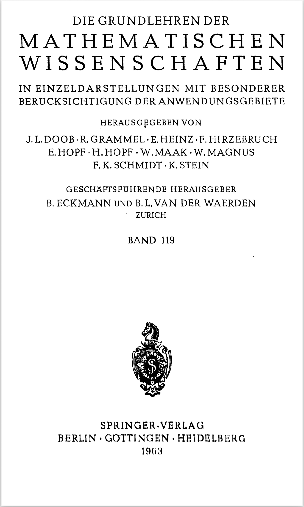

<!-- title: mathematischen wissenschaften Note -->
# mathematischen wissenschaften Note by Steven He

# Historical background

## Galton-Watson process

#### problem of the extinction of families
$p_i$ denote the probability of a man having $i$ sons,
$Z_i$ denote the number in each generation
want: probability that the male line extincts after $r$ generations

### assumptions

#### Markov chain
the past does not matter for the future, only the present does

#### special property
individuals don't interact

### mathematical description
assume $Z_0=1$
$$P(Z_i=k)=p_k$$

#### transition probability $$P_{ij}=P(Z_{n+1}=j|Z_n=i)\qquad i,j,n=0,1,\dots$$

#### generating function $$f(s)=\sum_{k=0}^\infty p_ks^k,\qquad |s|\leq 1$$

#### iterate $$f_0(s)=s,\qquad f_1(s)=f(s),\\f_{n+1}(s)=f[f_n(s)]\qquad n=1,2,\dots$$

$$\Rightarrow f_{m+n}(s)=f_m[f_n(s)]$$

### basic assumptions
strictly convex on the unit interval
$$p_i\neq1,p_0+p_1<1$$
$$
\mathcal{E} Z_1=\sum_{k=0}^\infty kp_k \text{ is finite}
\Rightarrow f'(1) \text{ is finite}
$$

### generation function of $Z_n$ is the n-th iterate $f_n(s)$

### moment of $Z_n$

let $$m=\mathcal{E}Z_1,\qquad \sigma^2=\text{Variance }Z_1=\mathcal{E}Z_1^2-m^2$$
$$m=f'(1),\qquad \sigma^2=f''(1)+m-m^2$$

#### expected value $\mathcal{E}Z_n=m^n,\qquad n=0,1,\dots$

#### $\text{Variance }Z_n$, if $\sigma^2=\text{Variance }Z_1<\infty$, is given by
$$
\text{Variance }Z_n=\begin{cases}
    \frac{\sigma^2m^n(m^n-1)}{m^2-m},\qquad &m\neq1\\
    n\sigma^2,\qquad &m=1
\end{cases}
$$

### probability of extinction
#### extinction—the random sequence $\{Z_n\}$ consists of zeros after a finite number of $n$
